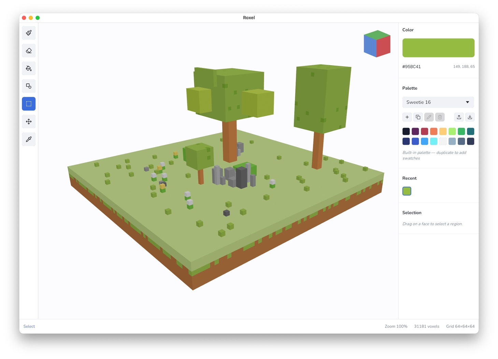

# Roxel

[](https://github.com/starzonmyarmz/roxel/actions/workflows/ci.yml)

A lightweight, open-source voxel editor for desktop. Simple to learn, fun to use, and nice to look at.



## Features

- Brush, erase, recolor, eyedrop, shape, select, and move tools on an open-world 3D voxel grid — paint anywhere on X / Z and as high as memory allows; the floor at y = 0 is the only hard boundary
- Shape tool: rectangle, ellipse, line — 2D on the active build plane or extruded into a 3D box / cylinder / line
- Select tool: drag a 3D AABB on a face plane, then bulk delete / recolor inside it
- Move tool: drag a selected voxel along the picked face plane or arrow-key nudge; click a bare voxel with no selection to move just that voxel
- Shift+click line draw between the last placed voxel and the cursor
- Built-in palettes (Sweetie 16, PICO-8, DawnBringer 16/32, Endesga 32, NA16, Basic) plus user palettes with add/new/duplicate/rename/delete and drag-to-reorder
- Orbit / pan / zoom camera with isometric default angle
- Save / load `.roxel` project files (RON)
- Import MagicaVoxel `.vox`, Qubicle `.qb`, and Goxel `.gox`
- Export to MagicaVoxel `.vox`, Goxel `.gox`, Wavefront `.obj`, Autodesk `.fbx` (binary 7.4), glTF `.glb` (Unity / Godot ready), transparent `.png`, and `.svg`
- Import / export Adobe Swatch Exchange `.ase` palettes
- In-app toast notifications for save / load / import / export results
- Light / Dark / System themes with separate canvas and floor color preferences, plus optional Minecraft-style floor grid lines and a permanent RGB axis triad at world origin

## Run

```sh
cargo run --release
```

Dev profile uses `opt-level = 1` for the crate and `opt-level = 3` for deps to keep iteration fast.

## Controls

| Key                      | Action                                                         |
| ------------------------ | -------------------------------------------------------------- |
| `B`                      | Brush                                                          |
| `E`                      | Erase                                                          |
| `P`                      | Paint (recolor existing voxel)                                 |
| `I`                      | Eyedropper                                                     |
| `S`                      | Shape (rect / ellipse / line; 2D or extruded)                  |
| `M`                      | Select (drag a 3D AABB on a face plane)                        |
| `V`                      | Move (drag a selected voxel; click bare voxel for ad-hoc move) |
| `Alt` (hold)             | Temporary eyedropper; releases back to previous tool           |
| `Shift` + click          | Draw a 3D line from the last placed voxel to the cursor        |
| `←` / `→` / `↑` / `↓`    | Nudge selection 1 voxel on X / Z (Move tool)                   |
| `Shift` + `↑` / `↓`      | Nudge selection 1 voxel on Y (Move tool)                       |
| `Shift` + drag           | Lock Move drag to the same horizontal plane                    |
| `Backspace` / `Delete`   | Clear voxels inside the active selection                       |
| `Space` + left-drag      | Pan (Figma/Photoshop style)                                    |
| `Z` + left-click         | Zoom in 2× toward target                                       |
| `Alt` + `Z` + left-click | Zoom out 2×                                                    |
| `Cmd/Ctrl + =`           | Zoom in 2×                                                     |
| `Cmd/Ctrl + -`           | Zoom out 2×                                                    |
| `Cmd/Ctrl + 0`           | Frame view on the voxel cluster (panel-aware)                  |
| `Cmd/Ctrl + Z`           | Undo                                                           |
| `Cmd/Ctrl + Shift + Z`   | Redo                                                           |

Left mouse drag in the viewport applies the current tool. Right mouse drag orbits the camera. Scroll to zoom.

## Packaging a macOS .app

```sh
cargo install cargo-bundle
cargo bundle --release
open target/release/bundle/osx/Roxel.app
```

The bundle picks up `assets/icons/roxel.icns` via `[package.metadata.bundle]` in `Cargo.toml`.

## Releases

Tagged versions trigger a GitHub Actions workflow that builds and uploads
`Roxel.app` (macOS) and `Roxel.exe` (Windows) to a GitHub Release.

To cut a release:

```sh
# bump version in Cargo.toml, commit
git tag v0.3.1
git push origin v0.3.1
```

The workflow lives at `.github/workflows/release.yml`. macOS builds are
**not notarized**, so Gatekeeper will block first-run; right-click → Open.
Windows builds are unsigned; SmartScreen will warn on first run.

## File format

`.roxel` projects are RON-serialized. Open-world: only occupied cells are
stored, no fixed grid size, coordinates are signed so models can sit at any
position relative to the origin.

```rust
struct ProjectFile {
    voxels: Vec<([i32; 3], Color8)>,
}
```

## License

MIT — see [LICENSE](LICENSE).
